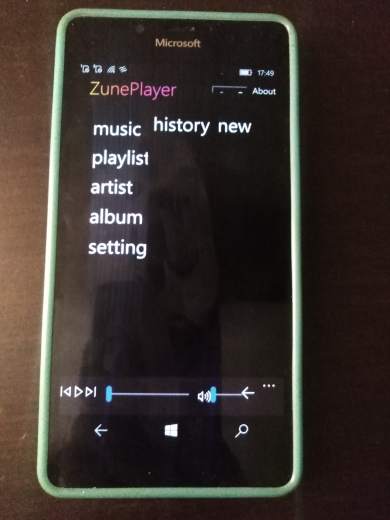

# ZunePlayer (tech num. 1.0.0)

My little RnD of bjason's Zune-like music player...

## About
Glad you find this repo. If you've heard about Zune, you would be glad that this repo is all about ;)

## Screenshot(s)

## My 2 cents
- "Zune theme" mini-research (design, animations, et.c)
- Temp. db codebase disabled
- Minimal bug workarounds / fixes
- UWP Codebase downgraded from 19041 to 14939 (pacthing DB SQL methods, xaml compatibility, etc.)

## Status
- Draft / Proto / Early bird

## W10M Environment
- UWP
- ARM
- Target Version: 10.0.19041.0
- Min Version: 10.0.14939.0 

## Credits / License
- https://github.com/bjason/ Yuchu Lei aka bjason
- https://github.com/bjason/nextplayer "Project NextPlayer", or original ZunePlayer 
- MIT

## ..
AS IS. RnD only. No support.

## .
[m][e] 2023
